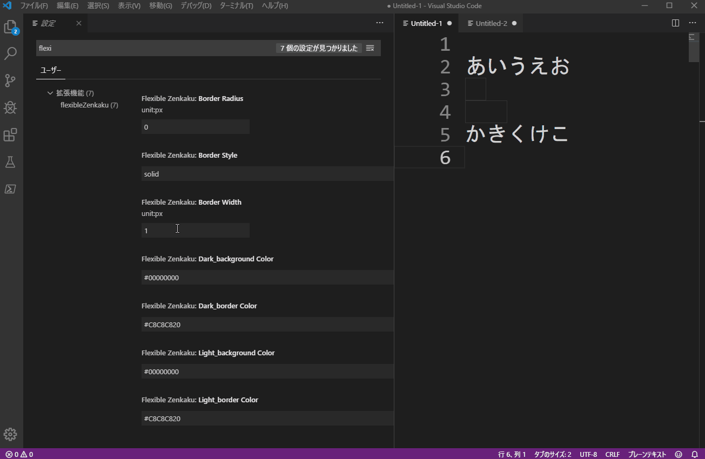

# flexibleZenkaku

This extension highlights Japanese double-byte spaces in the editor.  
This extension was developed based on “zenkaku” by mosapride.  
Some setting items has been added to "zenkaku" to make it easy to change the highlight color and appearance.

## Extension Settings

The following setting items can be changed for the appearance when double-byte space is highlighted.   
By default, it is highlighted by border.

- `flexibleZenkaku.borderWidth`: border thin (default: 1px)
- `flexibleZenkaku.borderRadius`: radius of border corner (default: 0px)
- `flexibleZenkaku.borderStyle`: border style (default: solid)
- `flexibleZenkaku.light_backgroundColor`: background color(in light theme)(default: #00000000)
- `flexibleZenkaku.light_borderColor`: border color(in light theme)(default: #C8C8C820)
- `flexibleZenkaku.dark_backgroundColor`: background color(in dark theme)(default: #00000000)
- `flexibleZenkaku.dark_borderColor`: border color(in dark theme)(default: #C8C8C820)

## Known Issues

In order to reduce the overhead, the number of events subject to ignition is minimized. Therefore, the settings may not be reflected in real time. In that case, try restarting VS Code.

## Release Notes

### 0.0.1

Release

## License

MIT

This extension was developed based on mosapride's "zenkaku" extension.  
<https://marketplace.visualstudio.com/items?itemName=mosapride.zenkaku>

----

## flexibleZenkaku(日本語)

この拡張機能は、エディタ内の日本語の全角スペースをハイライトします。  
この拡張機能はmosapride氏の「zenkaku」を元に開発されました。  
「zenkaku」に設定項目を追加して、ハイライト時の色や見た目を簡単に変更できる様にしています。

## 拡張機能設定

全角スペースをハイライト時の見た目について、下記の設定項目を変更可能です。  
初期設定では、境界線でハイライトします。

- `flexibleZenkaku.borderWidth`: 境界線の太さ(初期値: 1px)
- `flexibleZenkaku.borderRadius`: 境界線のコーナーの半径(初期値: 0px)
- `flexibleZenkaku.borderStyle`: 境界線のスタイル(初期値: solid)
- `flexibleZenkaku.light_backgroundColor`: lightテーマのときの背景色(初期値: #00000000)
- `flexibleZenkaku.light_borderColor`: lightテーマのときの境界線の色(初期値: #C8C8C820)
- `flexibleZenkaku.dark_backgroundColor`: darkテーマのときの背景色(初期値: #00000000)
- `flexibleZenkaku.dark_borderColor`: darkテーマのときの境界線の色(初期値: #C8C8C820)

## 既知の問題点

負荷を抑えるため、発火対象イベントを最小限にしています。そのため、リアルタイムで設定内容が反映されないことがあります。その際は、本拡張機能を「無効」→「有効化」してみてください。

## リリースノート

### 0.0.1

公開

## ライセンス

MIT

本拡張機能は、mosapride氏のzenkaku拡張機能をベースに開発されました。  
<https://marketplace.visualstudio.com/items?itemName=mosapride.zenkaku>
